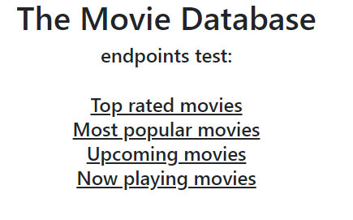

# Spring Boot The-MovieDB API endpoints

## About
The following repo contains a Spring Boot example that uses a REST API called: The Movie Database at https://www.themoviedb.org/

## I've learned how to:
* store an API KEY without being shown to the public
* use @RestTemplate annotation
* consume a REST API
* send params for different API requests

## Run this application:
* open browser at:
```
http://localhost:8080/
```

## Routing:
* "/" index page:



* "/top_rated" show top-rated movies
* "/popular" show most popular movies
* "/upcoming" list upcoming movies
* "/now_playing" list movies currently at theaters